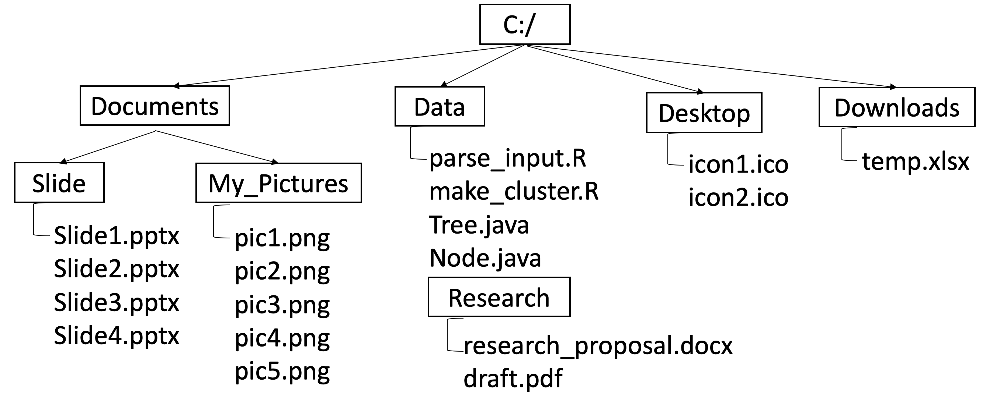

# Pohon Berkas

Pohon/_Tree_ adalah struktur data non-linear yang dapat digunakan untuk menyimpan struktur folder/berkas di komputer. Stuktur data Pohon terdiri dari simpul (_node_), dengan simpul akar (_root_) sebagai simpul teratas. Di tugas ini anda diberikan template koding Java yang akan membuat sebuah pohon berkas seperti gambar di bawah. Tugas anda adalah menambahkan fitur untuk dapat menghitung jumlah bytes yang disimpan dalam sebuah pohon berkas, yaitu jumlah kumulatif semua berkas di pohon tersebut. 




## _Template_ koding Java
Untuk membuat pohon berkas, anda diberikan koding Java berikut:
1. [FolderTree.java](FolderTree.java) adalah kelas Java yang membuat pohon seperti gambar di atas. Perhatikan cara pohon dideklarasikan dan simpul anak ditambahkan. Ketika sebuah simpul anak ditambahkan, maka kita memberikan informasi dimana simpul ini akan ditambahkan (_parent folder_), nama berkas dan ukuran berkas dalam bytes. Di akhir koding Java ini terdapat pemanggilan method _calculateSize()_ yang harus anda selesaikan implementasinya.

2. [Node.java](Node.java) adalah kelas Java yang merepresentasikan sebuah simpul di pohon berkas. Setiap simpul menyimpan nama berkas, ukuran berkas dan berkas/folder di bawahnya. Anda diperbolehkan menambah method/variabel baru yang anda butuhkan

4. [Tree.java](Tree.java) adalah kelas Java yang merepresentasikan pohon berkas. Setiap pohon memiliki sebuah simpul akar (_root node_). Di kelas ini terdapat method _calculateSize()_ yang harus anda selesaikan implementasinya. Method ini akan mengembalikan ukuran semua berkas (kumulatif) yang ada di pohon tersebut dalam bytes. Berikut adalah contoh luaran program yang benar dari _FolderTree.java_ ketika method _calculateSize()_ diimplementasikan dengan benar. Anda diperbolehkan menambah method/variabel baru yang anda butuhkan

## Contoh luaran program
```{r tidy=TRUE}
Slide1.pptx: 67545366
Slide2.pptx: 6820603
Slide3.pptx: 5909391
Slide4.pptx: 19324884
Slide: 99600244
pic1.png: 27556
pic2.png: 94712
pic3.png: 70743
pic4.png: 89635
pic5.png: 74476
My_Pictures: 357122
Documents: 99957366
research_proposal.docx: 29324888
draft.pdf: 12324007
Research: 41648895
parse_input.R: 3638
make_cluster.R: 7781
Tree.java: 10180
Node.java: 10446
Data: 41680940
icon1.ico: 3559
icon2.ico: 1471
Desktop: 5030
temp.xlsx: 152441
Downloads: 152441
C:/: 141795777
```

## Instruksi pengumpulan
Kumpulkan **Node.java** dan **Tree.java** anda melalui codepost dengan tenggat waktu: **Sabtu, 14 Oktober 2023 jam 23:59**. 


## Kriteria Penilaian
|Kriteria  | Poin |
| --- | --- |
|Hasil _Unit Test_ di codepost |70|
|Menggunakan _Tree.java_ dan _Node.java_ yang sudah diberikan|30|


## Integritas
Tugas ini harus dikerjakan secara mandiri. Mahasiswa yang terindikasi menyontek akan mendapat nilai 0.


