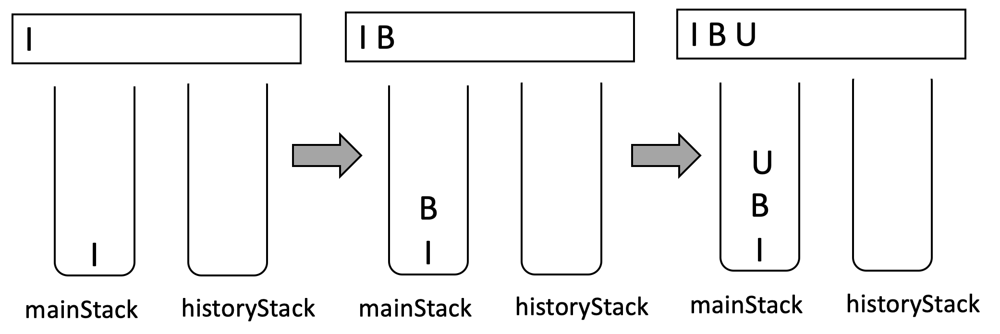
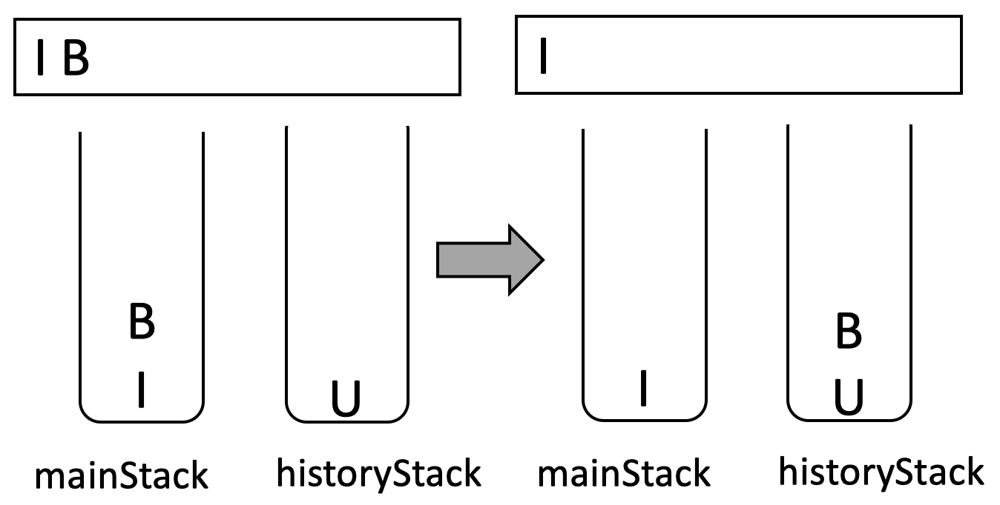
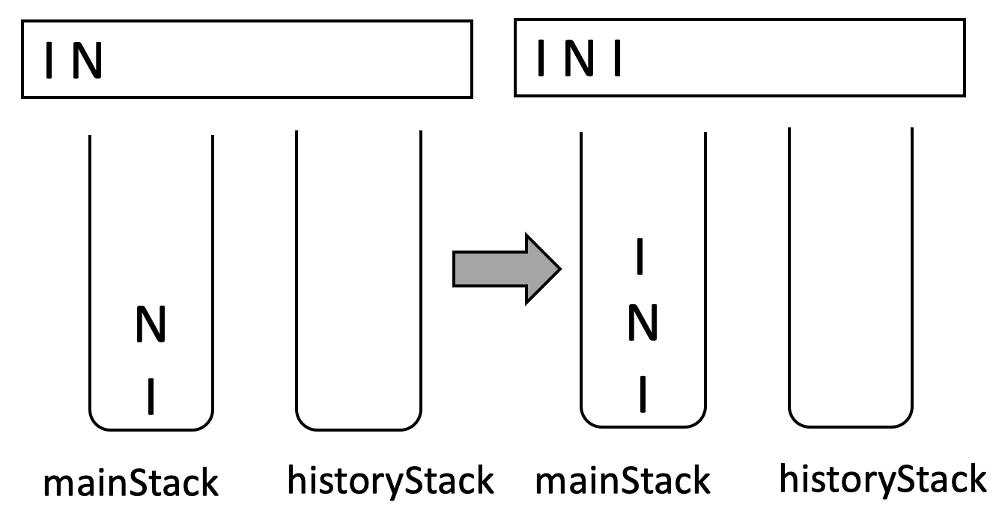
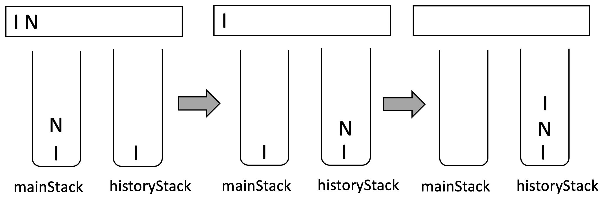
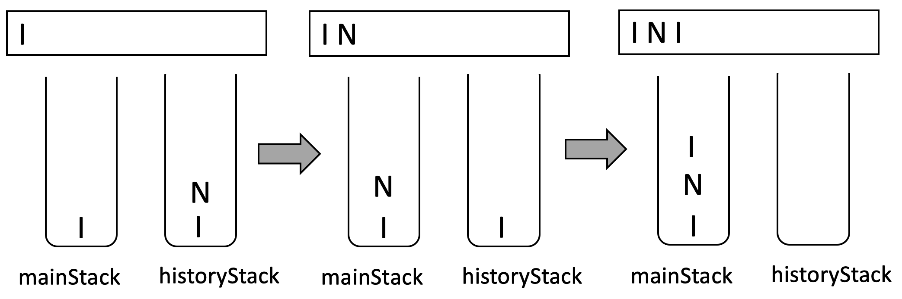
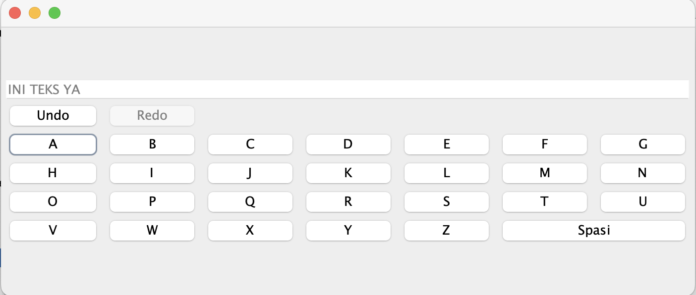

# Text Editor/ Editor Teks

Di tugas ini anda diminta membuat sebuah teks editor sederhana di Java dengan fitur _undo_ dan _redo_ yang harus diimplementasi dengan struktur data _stack_. Operasi _undo_ akan membatalkan perintah terakhir di komputer sementara operasi _redo_ akan mengembalikan operasi terakhir yang dibatalkan. 

_Stack_ adalah sebuah struktur data yang bersifat _Last In First Out_ (LIFO). Objek yang pertama masuk ke _stack_ akan menjadi objek yang paling terakhir diambil dari _stack_. Sebaliknya, objek yang dapat diambil dari _stack_ adalah adalah objek yang terakhir masuk _stack_. 

## Fitur _undo_ dan _redo_ di teks _editor_
Operasi _undo_ dan _redo_ dapat diimplementasikan dengan menggunakan dua struktur data _stack_. Secara umum penggunaan _stack_ dalam fitur _undo_ dan _redo_ adalah sebagai berikut:
1. Terdapat dua _stack_: 
  - stack utama (_mainStack_) yang akan menyimpan setiap karakter yang terlihat di layar anda.
  - stack pembantu (_historyStack_) yang akan menyimpan setiap karakter yang dikeluarkan dari _mainStack_ karena operasi _undo_

2. Anda memasukkan karakter I, B dan U dalam teks editor, maka _mainStack_ berisi ketiga karakter tersebut dengan karakter U berada di posisi paling atas. 

3. Apabila anda klik tombol _redo_ dua kali, maka karakter U dan B akan dikeluarkan dari _mainStack_ untuk masuk ke _historyStack_.

4. Anda kemudian memasukkan karakter baru yaitu N dan I, maka hal yang terjadi adalah:
 - Karakter N dan I masuk ke _mainStack_
 _ Ketika karakter N masuk _mainStack_, maka _historyStack_ akan dikosongkan.

5. Apabila anda klik _undo_ tiga kali, maka karakter I, N dan I akan berpindah dari _mainStack_ ke _historyStack_

6. Jika ingin mengembalikan kata INI, maka anda cukup klik _redo_ tiga kali, yang mengakibatkan karakter I, N dan I akan keluar dari _historyStack_ ke _mainStack_

## Contoh solusi
Contoh solusi dari program ini dapat dilihat di [asd_teks_editor.mp4]](asd_teks_editor.mp4)

## _Template_ koding Java
Untuk mengimplementasi teks editor ini, anda diberikan koding Java berikut:
1. [TextEditorGUI.java](TextEditorGUI.java) adalah kelas Java yang akan menampilkan GUI dari Teks Editor anda. Ketika dijalankan akan menampilkan panel sebagai berikut:

Di kelas ini, anda harus mengimplementasi fitur pengetikan huruf A-Z dan spasi. Apabila salah satu huruf/simbol diklik, maka akan muncul di _TextField_ di bagian atas panel. 

2. [Stack.java](Stack.java) adalah kelas _interface_ yang mendefinisikan operasi untuk _stack_ yang sudah kita diskusikan di kelas. Kelas ini sudah lengkap, anda tidak perlu menambahkan koding anda.

3. [ArrayStack.java](ArrayStack.java) adalah kelas Java yang mengimplementasi _interface_ Stack. Kelas ini sudah lengkap, anda tidak perlu menambahkan koding anda.

4. [TextEditor.java](TextEditor.java) adalah kelas Java yang mengimplementasikan logika untuk fitur _undo_ dan _redo_. Di kelas ini sebaiknya anda mendeklarasikan _stack_ utama dan pembantu. 

## Instruksi pengumpulan
Kumpulkan **TextEditor.java** dan ****TextEditorGUI.java** anda dalam sebuah zip file dan kumpulkan melalui Google Classroom dengan tenggat waktu: **Sabtu, 23 September 2023 jam 23:59**. Jangan lupa untuk menghapus deklarasi package (apabila ada) di koding Java anda.

## Kriteria Penilaian
Tombol huruf dan spasi dapat menambah karakter di layar  10
Tombol _undo_ hanya aktif apabila operasi dapat dilakukan 5  
Tombol _redo_ hanya aktif apabila operasi dapat dilakukan 5 
Tombol _undo_ bekerja sesuai dengan deskripsi tugas 10
Tombol _redo_ bekerja sesuai dengan deskripsi tugas 10
Penggunaan _stack_ tepat untuk fitur _undo_ dan _redo_ 30
Menggunakan ArrayStack.java untuk struktur data _stack_ 20
Berkas koding mempunyai komentar yang cukup 5
Berkas koding diformat sesuai rekomendasi Java Doc 5

## Integritas
Tugas ini harus dikerjakan secara mandiri. Mahasiswa yang terindikasi menyontek akan mendapat nilai 0.

